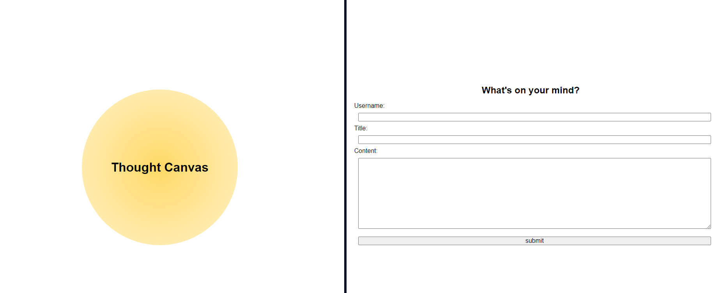
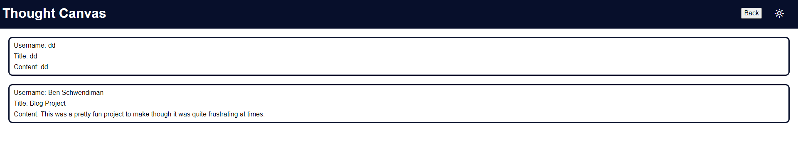

# <Thought Canvas Personal Blog>

## Description

A simple personal blog website with a home page for entering the blog content and a blog page where the content is then stored. Content is stored to local storage.

## Usage

On the home page you can enter a username the title of the blog and the blog content. On submit it will take you to the second page where the blog is stored. At the top of the pages on the right hand corner is a toggle for light or dark mode.

    ```md
    
    
    ```

## License

MIT

## Badges


